# BuyMySari

Completed as Term 2 Ruby on Rails major assessment at [Coder Academy's](https://coderacademy.edu.au/) GenTech 2019 Bootcamp


### [R7] [R8] Problem Statement and Solution

------

#### Problem 

**Why**

Fashion has become disposable and the environmental impact of this behaviour is significant.

The rise of fast fashion – the rapid mass production of inexpensive clothing in response to the latest trends has made the fashion industry one of the major polluting industries in the world.

The production and distribution of crops, fibres and garments is depleting non-renewable resources, requiring enormous quantities of chemicals, water and energy, all of which contribute to water, air and soil pollution.

At the other end, clothes dumped in landfill can take up to 200 years to decompose, leaching chemicals into the soil and emitting methane, a greenhouse gas 30 times more potent than carbon dioxide.

**Why Austrlia**

Australia is the second largest consumer of new textiles, averaging 27kg of new textiles per capita per annum.

But as quickly as we’re buying clothes, we’re throwing them away. Of these 27kg, 85% are discarded into landfill each year.

**Why buy and sell Second Hand Saree**

Saree often evoke a feeling of nostalgia and memory, associating certain saree with particular moments or events, or with the memory of your grandmother, for example. Saree are often passed down from one generation to the next, as part of a wedding trousseau or given as gifts for milestone moments. 

For generation Saree has been special garment worn during that special occasion like marriage, birthdays and other religious and cultural functions for girls and women from  Nepal, India, Sri Lanka, Pakistan and Bangladesh. And they come with the huge price tag.

However; most of the time they are only worn once or twice and live in wardrobe forever. In this world of social media where pictures are shared constantly through Facebook, Instragram and Twitter, it is considered bad  to wear same outfit again once they are visible in the social media. Also, with fast change in the trend; new outfit will gain the attention and these old expensive saree will get cluttered in the wardrobe. 

And at some point they will end up in dumpsters causing huge environmental problem. Discarded clothes take up valuable space in landfills that should only be occupied by materials that are not reusable or recyclable.

Additionally, Manufacturing and dyeing clothes requires the use of potentially dangerous chemicals. These chemicals pose a threat not only to the water, the air, and the earth but also to the people working with them. By buying used clothing, we can reduce our environmental impact in several ways.


**Solutions**

Many households have expensive beautiful Sarges hanging in the closets that are in practically perfect condition because they’ve only been worn a handful of times. Yet, when the next wedding or social event rolls around, there is still the urge to wear something new. Now, using ***BuyMySari***, you can sell your “old” outfits and not feel guilty about picking out something new, or just “new” to you! ***BuyMySari*** creates the perfect solution for both buyers and sellers.

It provides a place for people to buy beautifully designed second hand sarres at a fraction of the cost. Sellers have an avenue to post their items and monetize on sarees that they don’t plan to wear again, while buyers can pick up beautiful “ alomst new” outfits at a fraction of the retail cost. You can finally buy that perfect Saree for your next event without breaking the bank!  Who doesn't want to make some extra cash from their gorgeous pre-loved wear while looking a million bucks ?

However; the biggest impact will be you will reduce your environmental impact and create a sustainable business.

**Why Australia**

Australia is a country of multicultralism. There is huge population from Nepal, India, Bangladesh, Srilanka and Pakistan that lives in Australia as their permanent home. The need for this kind of business will only be growing as more and more people from this background will live in Australia. So there is necessity for this kind of business to exist not only for making money but also making clothes more sustainable and environment friendly.


**Why online and whats wrong with the sites that already exists**

Buying and selling online is more convenient as everybody has smart phone these days with 24hrs access to internet. People can buy anywhere around Australia, so it is not restricted to certain location. Since it is two way marketplace; anyone with smart phone and internet can start selling online. It will also make it less expensive as there is no need to have physical shop or presence.

Firstly; there are only few shops that sells only second hand saree online in Autralia. Also; they are not two-sided, so someone owning saree has to sell it to the website owner. Also; the presence among the market is not that noticeable.


### R11. Description of Marketplace app

------

#### Purpose

The purpose of this site is to provide a platoform to buy a good condition second-hand saree at a fraction of cost. Sellers have an avenue to post their items and earn extra income on sarees that theu don't plan to wear again, while buyers can pick up beautiful nearly new sarees at up to 50% of the retail cost.

It can also be used to demonstrate what I have learned about Ruby on Rails, HTML, CSS and SASS, and showcase my abilities in full stack web development.

------

#### Functionality / Features

##### 1. User Authentication using Devise

User needs to generate password protected sign up and to login  into their account.  Authentication of user is checked by devise and email address and password needs to match for usert to perform different actions like login to account, create, add, delete or update the listing, purhase or sell the listing, update or destroy the user profile and also to comment or chat in the app.

app\controllers\listings_controller.rb

```ruby
before_action :authenticate_user!, only: [:new, :create, :edit, :update, :destroy]

```


- On the navigation bar, different Sign Up/Sign in and Log Out tabs are shown depending on the user’s status.

  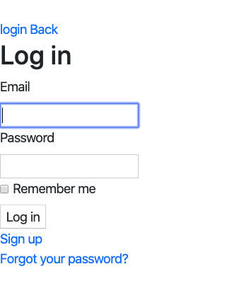

  


##### 2. User Authorisation

Users are limited to the scope of what they are authorised to do once they are logged in. Only the listing 	owner can edit, update and delete their listings. So they can see the edit and delete buttons on the show 	listing page for thier listings and others listings. Simillarly, with comment feature they only can delete	their comments and not others comments.


```ruby
def set_listing
      @listing = Listing.find(params[:id])
    end

    def set_user_listing
      id = params[:id]
      @listing = current_user.listings.find_by_id(id)
      if
       @listing == nil
        redirect_to listings_path
      end
    end
```


```ruby
before_action :set_listing, only: [:show]
before_action :set_user_listing, only: [:edit, :update, :destroy]
```

```ruby
<td><%= link_to 'Show', listing %></td>
        <td><%= link_to 'Edit', edit_listing_path(listing) if user_signed_in? and listing.user.id == current_user.id  %></td>
        <td><%= link_to 'Destroy', listing, method: :delete, data: { confirm: 'Are you sure?' } if user_signed_in? and listing.user.id == current_user.id  %></td>
      </tr>
      <% end %>
```


##### 3. Image uploading

Amazon Web Service(AWS)  S3 bucket is used to upload any images for their listings. By doing this the app will have less load and will function seamlessly. 

##### 4. Buying capabilities:  

Stripe is used for buyers to buy and pay for their products. However, they are suppose to login before they are able to purchase any products. After a product is purchased it dissaperars from the listing. So that once it is purchased it can't be purchased again.

```ruby
def show
    if current_user #user_signed_in?
    session = Stripe::Checkout::Session.create(
        payment_method_types: ['card'],
        customer_email: current_user.email,
        line_items: [{
            name: @listing.title,
            description: @listing.description,
            amount: @listing.price * 100,
            currency: 'aud',
            quantity: 1,
        }],
        payment_intent_data: {
            metadata: {
                user_id: current_user.id,
                listing_id: @listing.id
            }
        },
        success_url: "#{root_url}payments/success?userId=#{current_user.id}&listingId=#{@listing.id}",
        cancel_url: "#{root_url}listings"
  )

  @session_id = session.id
  
    end
  
  end
```

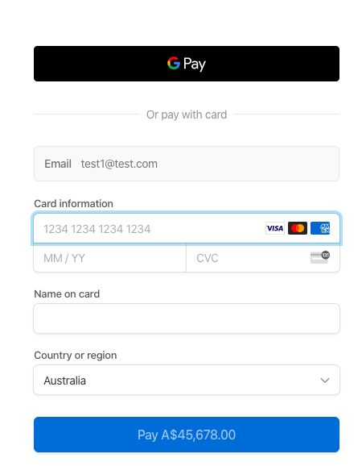


##### 5. Messaging 

Users once login can chat with each others. So if one of the buyers have any queries about the product or the want to know about the address of the product to be picked they can straight away chat to the seller through the show page by clicking on their username/email address. This will take them to the chat page and they can selecte their desired seller and have two way communication. Mailboxer gem is used for this purpose.


##### 6. Commenting

Users can comment in any listings once they are logged in. They can do this once they are are in the show page. This helps potential buyer to know about what others are thinking about the product. However; they can only delete thier comments and not anyone else comments.


```ruby
class CommentsController < ApplicationController
  
  before_action :authenticate_user!, only: [ :create, :destroy]
    def create
        @listing = Listing.find(params[:listing_id])
        @comment = @listing.comments.create(comment_params)
        redirect_to listing_path(@listing)
    end

    def destroy
        @listing = Listing.find(params[:listing_id])
        @comment = @listing.comments.find(params[:id])
        @comment.destroy
        redirect_to listing_path(@listing)
      end
     
      private

        def comment_params
          params.require(:comment).permit(:commenter, :body)
        end

end
```

Config\routes

```ruby
resources :conversations do
    resources :messages
  end

```


##### 7. User profile

User profile is created while they first sign-up. All the details are collected while they signup like username, first and last name, address, email address and password. This is done using the devise. A seperate page for users are created from where, an individual profile page can be visited for the user. There user profile page is also linked to all the listings they have created. So this way all the listings creted by this particular user is listed in his profile page and are clickable. This will take you to individual listing.


```ruby
class UsersController < ApplicationController

  def index
    @users = User.all
  end

  def show
    # id = params[:id]
    # @userprofile = User.find(:id)
    @user = User.find(params[:id])
    @user_listings = @user.listings
    @users = User.all
  end

end

```


##### 8. Searching Capabiltiy

Ransack gem is used for anyone to seamlessly search for the product.  

- With 'Simple Search', users can search listings by listing titles, fabric or color (this is a fuzzy search & case-insensitive search).
- With 'Advanced Search', users can search listings by dropdown style menu. Checkbox is created for user to select the desired style and click the search button.

app\listing_controller.rb

```ruby
		def index
		@q = Listing.ransack(params[:q])
    @listings = @q.result.includes(style: [])
    end
```


```ruby
<%= search_form_for @q do |f| %>

  <%= f.search_field :title_or_description_or_fabric_or_color_cont %>
  

      <% Style.all.each do |style|%>
          <%= check_box_tag "q[style_name_cont_any][]", style.name%>
          <%= style.name %>
      <% end %>

  <%= f.submit %>

<% end %>

```


------


#### Sitemap

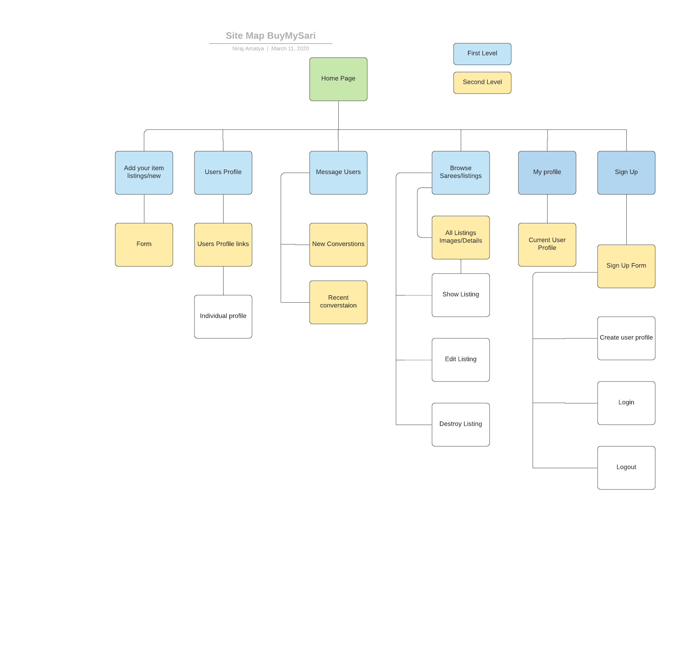

------


#### Screenshots


------


#### Target Audeience

- Target audience of this app are especially women from Nepal, India, Srilanka, Pakistan and Bangladesh background living in Australia. Also, someone from other than above coutries who might have to go to Nepalese or Indian wedding, will be a target audience as they can buy a saree for just once without breaking their bank.

- Potential employers and recruiting agencies
- People who are interested in my personal projects

------


####Tech Stack

* Programming Languages: Ruby on Rails, JavaScript, HTML, CSS, SASS

* Source Control: Git & GitHub

* Planning & Implementation: 

* 1. Project management (Trello)

  2. Mood board (Pinterest)
  3. 3. Wireframes (Balsamiq)

* Deployment : Heroku

* Payment Processing: Stripe

* Cloud Storage: AWS - S3

* Security: AWS - IAM


------


### R12. User Stories from app

#### **User should be able to sign up, sign in and signout**

***Feature***

* **Sign up:**

  As a visitor to the site, I should be able to with my email address and password.

* **Sign in:**

  As a user, I should be able to sign in using my email address and password that I created while signing up.

* **Sign out:** 

  As a logged in user, I should be able to signed out of my account when I am signed in.

  

#### Create, edit, upload, delete and view  profile 

***Feature***

* **Create Profile**

  As a user I should be able to create my profile with all the details.

* **Edit Profile**

  As a signed user, I should be able to edit all the information in my profile in the future so that I can update it.

* **Upload**

  As a signed user I should be able to upload my profile picture as many times as I need.

* **View Profile**

  As a user, I should be able to view my profile details when I am logged in.

* **Delete**

  As a logged in user, I should be able to delete only my profile page.

  

#### Editing, viewing or deleting  others profile 

**Feature:** Unable to edit other user's profile

As a user I should not be able to edit, delete or view others profile page .


#### Managing listings that belongs to user

 ***Features***

* **Create listing**

  I should be able to create new listing for my sarees, If I am signed in.

* **Update listing**

  As a logged in user, I should be able to make changes and update my listings.

* **Delete listing**

  As a signed in user, I should be able to delete my listings.

* **Upload photos for listing**

  As a signed in user, I should be able to upload photos for my listings.

* **View listings**

  As a logged in user, I should be able to view all the listings that I created.

* **Delete Listings**

  As a signed in user, I should be able to delete all the listings that I created.

  

#### Viewing, Editing or deleting others listings

  ***Features*** : Unable to manage others listing 

  As a user, nobody should be able to view, edit or delete my listings other than myself. 

  

#### View Saree listings in homepage without signing and signing in

  ***Feature***: View listings in homepage without signing up and signing in

  As a user I should be able to view all the listings in homepage withot signing up and signing in, even if they are not my listings.

  

#### View detailed product information without sigining in or signing up

  ***Feature***: Product details without siging in or signing up

  As a user, I should be able to view the product details in the show page without signing in or signing up.

#### Users using messaging feature

- As an admin, user should sign-up or sign- in before they are alllowed to message other users and vice-versa.
- As a user I should be able to send messages to other buyers or sellers regarding enquiry about products.


#### Users commenting on the listings

- As a user I should be able to comment on all the listings ans should be able to see others comment as well.
- As an admin, users should only be able to comment on the listings once they are logged in. They should not able to delete or modify others comments.

------

### R13. Wireframes for app
User Profile

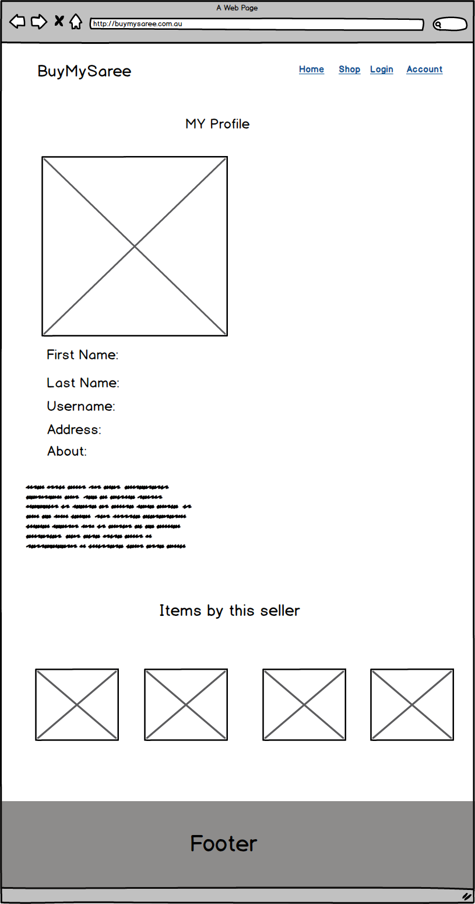

Show Page for Buyers
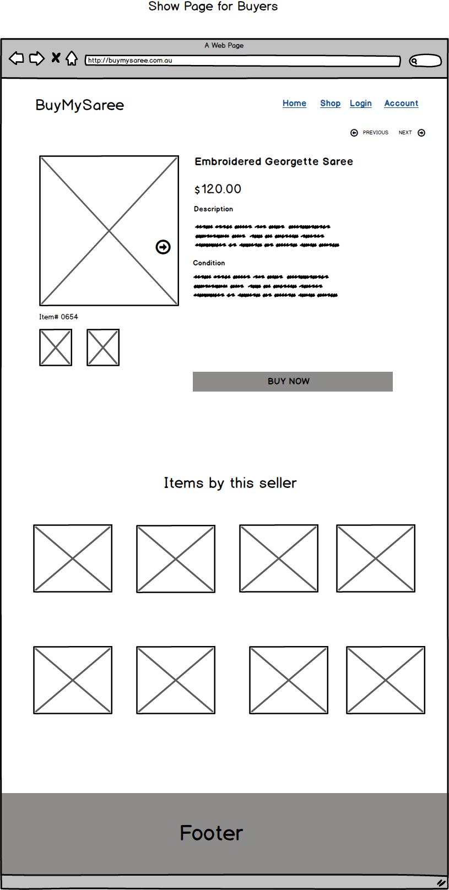

Show Page for Sellers


Home Page
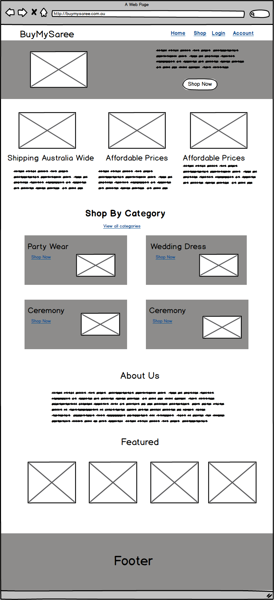

Listing Page
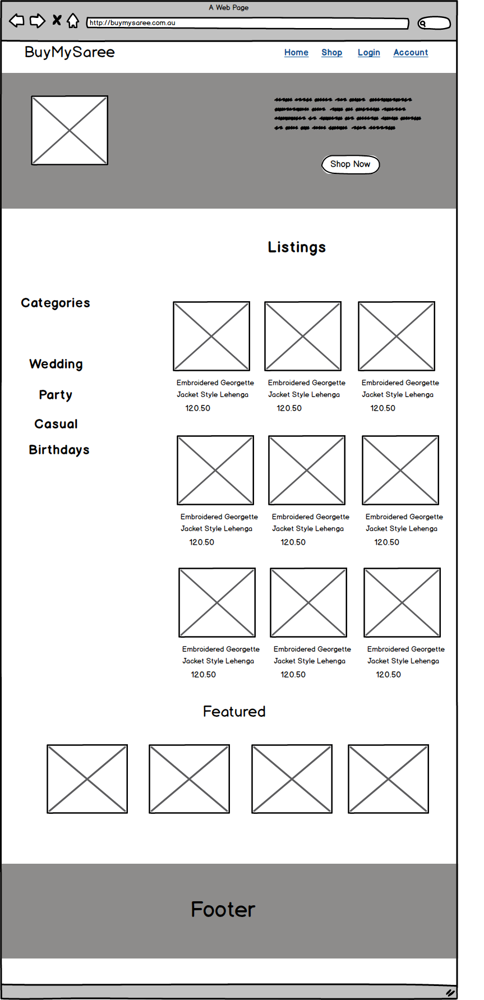

Mobile Show Page for Buyers
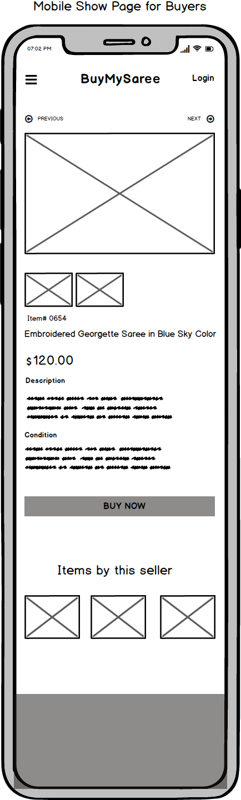

Mobile Show Page for Sellers


Mobile Home Page
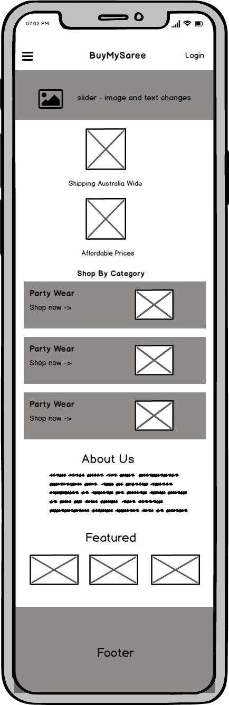

Mobile Listing Page
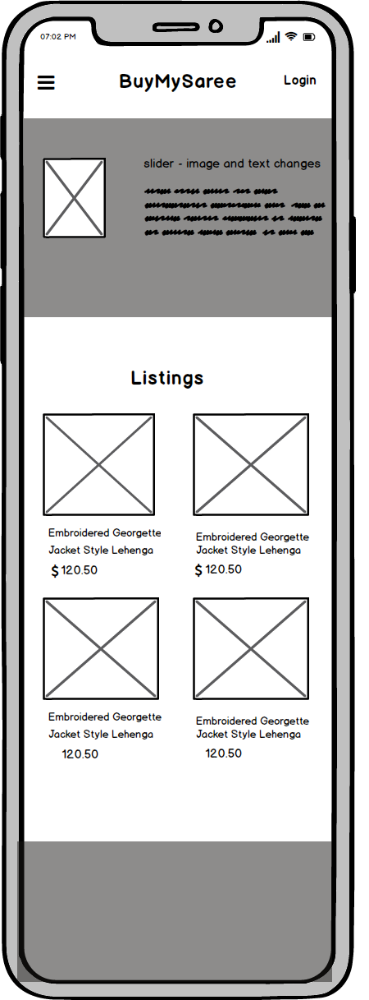

------


### R14. An ERD for app


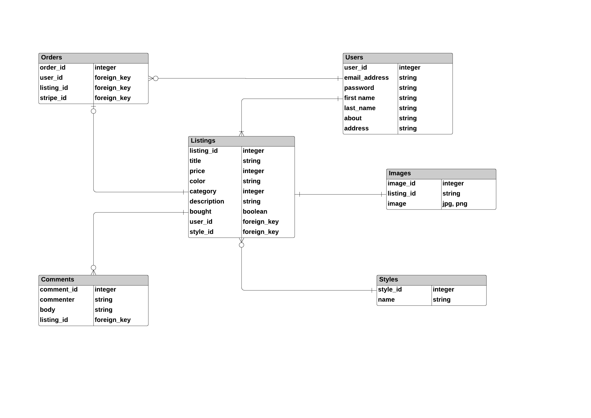

------


### R15. Explain the different high-level components (abstractions) in your app


My Web App is build in Ruby on Rails, following the architectural pattern known as MVC, where the entire app is broken down into THREE high-level components:

- Models
- Views
- Controllers


RoR follows the design pattern of Model-View-Controller (MVC). It also follows the rule of 'convention over configuration'. 'Separation of concerns' plays major role in ROR architecture, so each component (model, view and controller) should only handle a specific set of actions for an application.

**Models**: 

The Model layer does the business logic of the application and the rules to manipulate or change the data. Active Record in the model layer is responsible for creating and managing data by communicating with the database. The Models reflect the information in the database and render the correct validations. Model in my app is used to associate different relationship between different tables like users, listings, comments, messaging and styles. The Model component is further browken down into several business objects:

- Comment
- Listing
- Order
- Style
- User


**Views**

In Ruby on Rails, views are HTML files with embedded Ruby code. This is only used to show the data to the user in the form of a view. This is how we interact with user. View is where we receive some data from the user or we provide information to the user. We try to keep our views less logical. We only give simple logic like if/else statement and loops in our views. Similarly to the Model, the View component is also broken down into sub-objects:

- Comments
- Conversations
- Devise
- Layouts for partials
- Listings
- Messages
- Pages
- Payments
- Users

**Controller**

Controllers interacts with models and views. Incoming requests from the browsers are handled by the controllers, who process the data from the templates and forward it to the views. All the business logic and authorisation is placed within the controller. Sub-objects of the Controllers are:

- Comments
- Conversations
- Listings
- Messages
- Pages
- Payments
- User


**Server**: Puma is used as default server. Puma is a small library that provides a very fast and concurrent HTTP 1.1 server for Ruby web applications (https://puma.io/). To access the server following command is run in terminal.

```ruby
$ rails server
```


**Routes**

All the user request is handled by routes and sends them to the desired destination. Server will read the routes.rb file and decide where we should send the http request to and what methods on our controller will be responsible. For example in Buymysaree app if user want to see the specific listings they have to go through localhost:3000/lsitings/id path.

```ruby
Rails.application.routes.draw do
  get 'payments/success'
  devise_for :users
  get "/", to: "pages#home", as: "root"
  resources :listings do
    resources :comments
  end
  resources :users

  resources :conversations do
    resources :messages
  end

  
  
  get "/payments/success", to: "payments#success"
  post "/payments/webhook", to: "payments#webhook"


  get "/:path", to: "pages#not_found"

end

```


**Assets** 

The assets is home for  JavaScript code, styling code  for CSS, SASS and other media files such as images in our rails app.


**Database**:  Database is the place where data is stored and models are just an bridge for us to interact with database. Data is stored in the rows and columns of the tables just like a spreadsheet. For Buymysaree app I am using Postgresql database. PostgreSQL is a general purpose and object-relational database management system. Most importantly it is free and open source.

##### Stripe:

Stripe is an online software platform, which specialising in payment processing. Stripe is a very powerful and flexible tool for e-commerce, as it also provides different types of payment methods, like one-off payment, recurring payment and subscription. Buymysari utilises Stripe as a secured way to process one-off payment.

Buymysari app uses Stripe as a secured payment process. Stripe specializes in payment processing online. Not only Stripe is very powerful and flexible tool that is popular among many e-commerce site, it also provides many payments methods.

Buymysari does not handle payment and store sensitive payment data by itself. All payments go through Stripe.

The Stripe payment processing also incorporates Webhooks. Once a payment is processed, Stripe uses webhooks to notify the app.


##### AWS - S3

Amazon Simple Storage Service (Amazon S3) is a cloud hosting service for any uploaded images. Buymysari uses AWS S3 Bucket to host images (pictures for user profiles and sari listings) instead of storing files locally.   

##### AWS - IAM

Buymysari also uses 'AWS Identity and Access Management to securely manage access to AWS services (in this case AWS S3). With AWS IAM, people can create and manage AWS users, and set up permissions to allow and deny their access to certain AWS resources.  

##### Devise

User needs to generate password protected sign up to login  into their account.  Authentication of user is checked by devise and email address and password needs to match for user to perform different actions like login to account, create, add, delete or update the listing, purhase or sell the listing, update or destroy the user profile and also to comment or chat in the app.

**Heroku**

My app was deployed on Heroku, a cloud-based Platform-as-a-Service, which manages server configuration, network management, database versioning and DNS management.

Heroku uses Puma as the web server,  Puma is used in developing of my app. Heroku provides URL for the user to access it live at anytime. This URL can also be customised to doamin name developer or owner would prefer.

Also, Heroku  provides a different deployment methods. I have connected my Heroku app with Github repo. Which means everytime I push my app to my githhub repo it will also be update to Heroku.

------


### R16. Third-party Service

There are numerous amount of third-party services used in this app to streamline the development and deployment process, including Ruby/Rails gems, third-party APIs and third-party platforms:

- **Devise**(https://rubygems.org/gems/devise): Flexible authentication solution for Rails with Warden
- **Stripe**(https://rubygems.org/gems/stripe/versions/1.57.1): Stripe is the easiest way to accept payments online. For details see: ([https://stripe.com](https://stripe.com/))
- **Mailboxer**(https://rubygems.org/gems/mailboxer/versions/0.15.1): A Rails engine that allows any model to act as messageable, adding the ability to exchange messages with any other messageable model. It supports the use of conversations with two or more recipients to organize the messages.
- **Aws-sdk-s3** (https://rubygems.org/gems/aws-sdk-s3/versions/1.0.0.rc2): Official AWS Ruby gem for Amazon Simple Storage Service (Amazon S3). This gem is part of the AWS SDK for Ruby.
- **Ultrahook** (https://rubygems.org/gems/ultrahook): Ultrahook lets you receive webhooks on localhost. It relays HTTP POST requests sent from a public endpoint (provided by the ultrahook.com service) to private endpoints accessible from your computer.
- **Faker** (https://rubygems.org/gems/faker/versions/1.6.3): is used to easily generate fake data: names, addresses, phone numbers, etc.
- **Ransack**(https://rubygems.org/gems/ransack/versions/1.7.0):  is the successor to the MetaSearch gem. It improves and expands upon MetaSearch's functionality.


#### Third-party platforms


##### Heroku:

My app was deployed on Heroku, a cloud-based Platform-as-a-Service, which manages server configuration, network management, database versioning and DNS management.

Heroku uses Puma as the web server,  Puma is used in developing of my app. Heroku provides URL for the user to access it live at anytime. This URL can also be customised to doamin name developer or owner would prefer.

Also, Heroku  provides a different deployment methods. I have connected my Heroku app with Github repo. Which means everytime I push my app to my githhub repo it will also be update to Heroku. All I have to do is run this command in terminal:

```
$ git push heroku master
```


##### Stripe:

Stripe is an online software platform, which specialising in payment processing. Stripe is a very powerful and flexible tool for e-commerce, as it also provides different types of payment methods, like one-off payment, recurring payment and subscription. Buymysari utilises Stripe as a secured way to process one-off payment.

Buymysari app uses Stripe as a secured payment process. Stripe specializes in payment processing online. Not only Stripe is very powerful and flexible tool that is popular among many e-commerce site, it also provides many payments methods.

Buymysari does not handle payment and store sensitive payment data by itself. All payments go through Stripe.

The Stripe payment processing also incorporates Webhooks. Once a payment is processed, Stripe uses webhooks to notify the app.


##### AWS - S3

Amazon Simple Storage Service (Amazon S3) is a cloud hosting service for any uploaded images. Buymysari uses AWS S3 Bucket to host images (pictures for user profiles and makeup listings) instead of storing files locally.   

##### AWS - IAM

Buymysari also uses 'AWS Identity and Access Management to securely manage access to AWS services (in this case AWS S3). With AWS IAM, people can create and manage AWS users, and set up permissions to allow and deny their access to certain AWS resources.  

  
------


#### Design Brief

Mood board for this site can be found on Pinterest: (https://www.pinterest.com.au/sirjanaamatya/saree-marketplace-app/more_ideas/?ideas_referrer=1)

  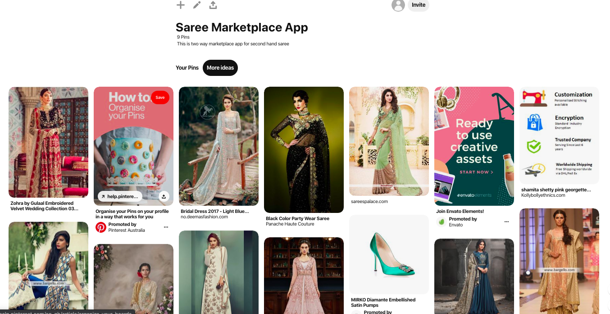

#### 

  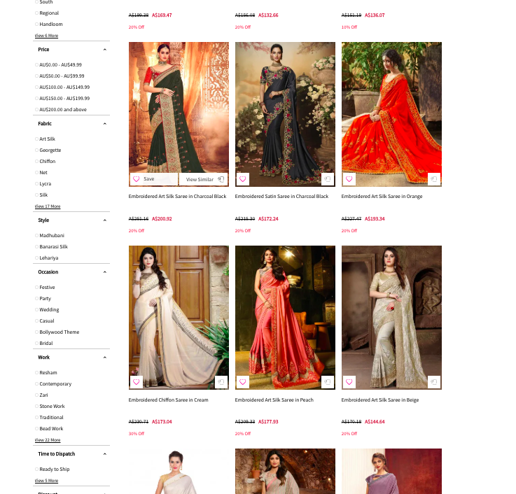

  
------


### R.17 Describe your projects *models* in terms of the relationships (active record associations) they have with each other

These are the model and relationshiop they have with each other:

**User model**

```ruby
has_many :listings, dependent: :destroy
has_many :orders, dependent: :destroy
```

The User has many listings and and has many orders. When the user is deleted all its relationship wuth listing and orders are also deleted. The user has_many relationship.

**Listing model**

```ruby
  belongs_to :user
  has_one :order
  has_one_attached :picture
  has_many :comments, dependent: :destroy
  belongs_to :style
```


- Listing model belongs to User and Style model. So listing table will have foreign key from user and style model. 
- Listing can only have one order, as every listing on my app is a unique item. Once a listing is purchased, it is no longer available to other users.  So it is has_one relationship.
- Listings also have its listing picture attached to active storage.
- Listing has, has_many relationship with comments, since any listing can have many comments from the user.

**Order model**

```ruby
belongs_to :user #user is a buyer
belongs_to :listing
```

- Order belongs to  users and  Listings.
- Orders table only store non-sensitive payment data like user id, listing id and purchase id (from Stripe).

  **Style model**

```ruby
has_many :listings
```

Each style will have many listings under it. Therefore; Style model has, has_many relationship with listing.

**Comment model**

```ruby
belongs_to :listing
```

Comment is performed on listing. So comments belongs to listing model. When listing is deleted all the comments for that specific listing will be deleted as well.

------


### R.18 Discuss the database relations to be implemented in your application

Listing table is the central table as this performs as the central logic of the business and as the joining table for the rest of the database.  The listing table will hold fields like title, price, color, fabric, category etc, however; it will also be associated to other tables like user table, style table, order table and comment table. The association is either using listing id as a foreign key in other tables or by putting foreign key in listing tables from other models. For example Listing table will have user_id as a foreign key as users will have many listings and also styles_id as foreign key, as each style may have many listings.

Similarly, Order table will have user_id, stripe_id and listing_id as a foreign key.  Since user will have many orders, each listing has one order and stripe_id for each order for payment processing. 

Comments will also have listing_id as a foreign key, since listing will have many comments.

This is how database relationship will be implemented in my database. By creating a relationship it will be easy to find which listing is created by which user or to  find all the listings belonging to particular style. 

This will also help to create authorization for users. So only owner of the listing can edit or delete there lsitings and not anyone else listings. Deleting any particular user will delete all the lsiting he/she has created, saving space from unnecessary data.

------


### R.19 Database Schema Design

Schema Design from DBeaver:

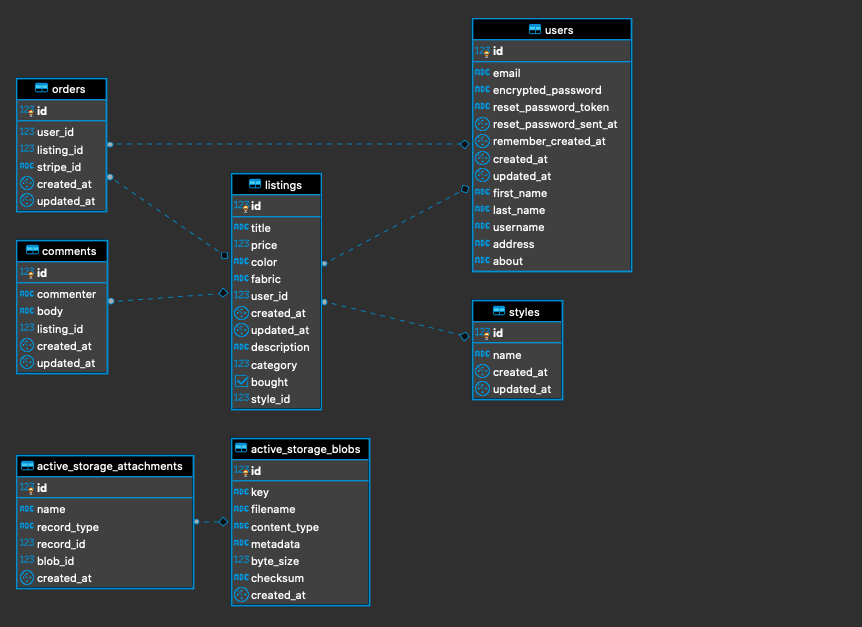


 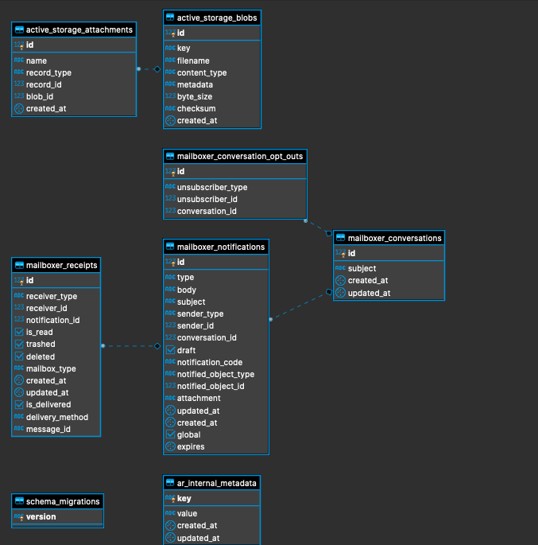


------


### R.20 Task allocated and tracked in the project

Trello was used for task allocation, planning and tracking (https://trello.com/b/wjy2La3R/marketplace-app). I used dates to meet the deadline in the trello for most of the task. Priority was given to  all the features that were labelled as Donut and were the core logic behind the business. After, finishing with donuts other features were added as a sprinkle features. 


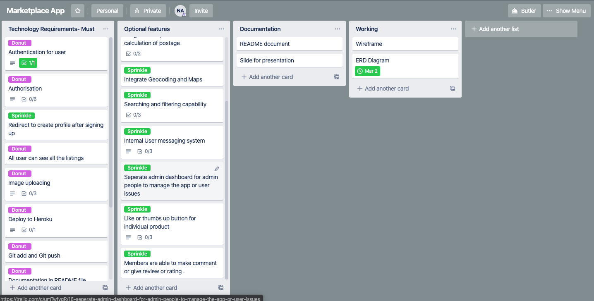

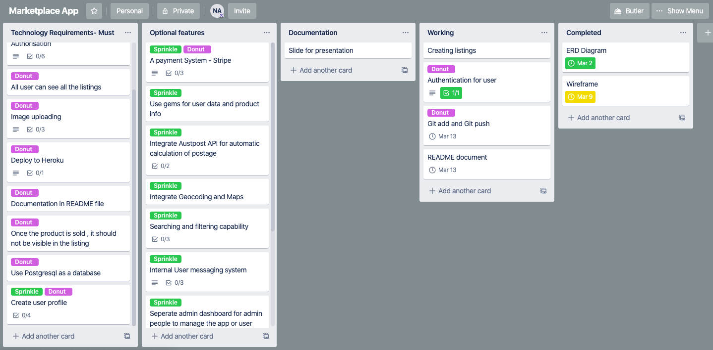

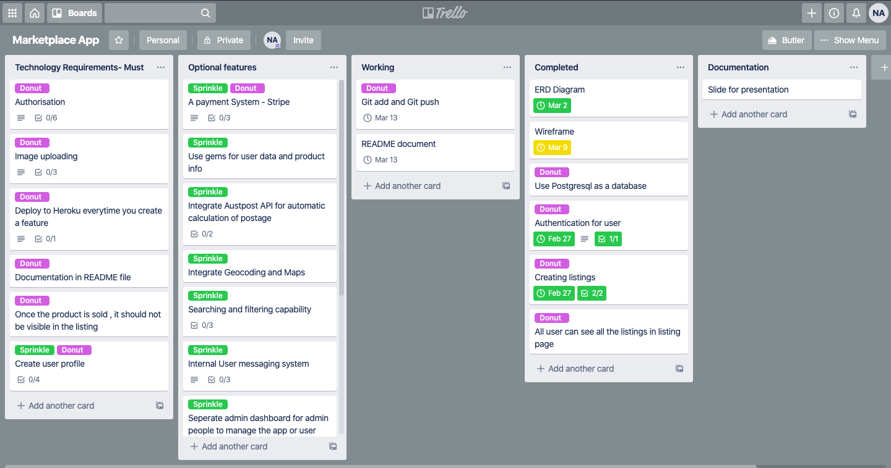

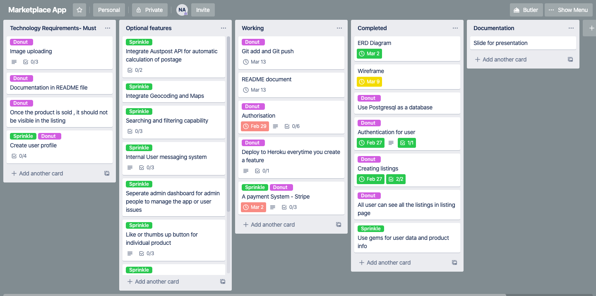

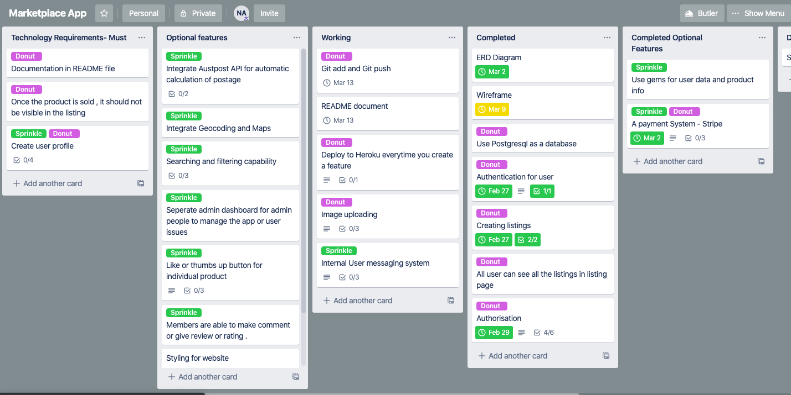

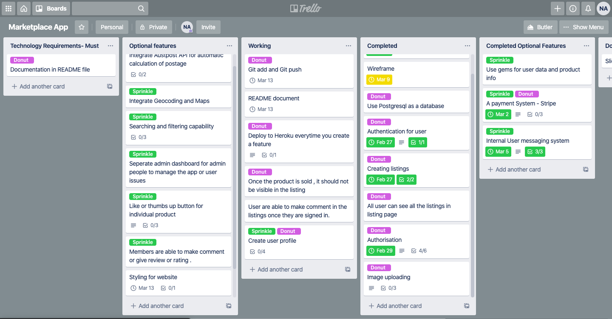

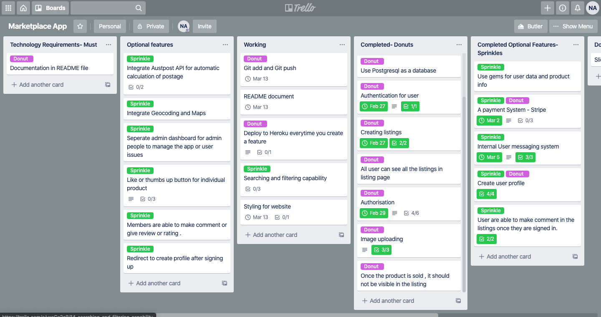

------


### General thoughts on development & future improvements

Overall, I was very happy with the project and with my progress throughout. I feel like I have progressed quite well from the last assignment, however, there are still a few features I would like to improve upon in future.

Add more features like:
* Integrate Australian Post API for automatic calculation of of postage
* Location based searching of products similar to Gumtree .
* Separate Admin 
* Likes or thumbs up button


------


